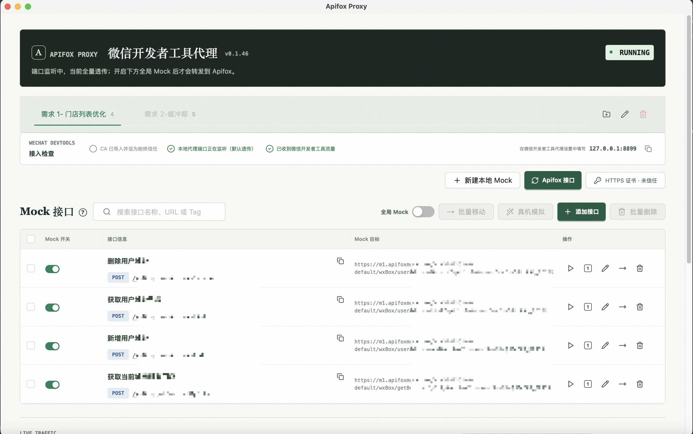

# Apifox Proxy Desktop

macOS 桌面代理工具，用于在不修改微信小程序代码的情况下，将微信开发者工具发出的指定 HTTP/HTTPS 请求转发到 Apifox Mock。

## 工作方式

```text
微信开发者工具 --显式 HTTP/HTTPS 代理--> 127.0.0.1:<项目端口>
                                          |
                                          +-- 全局开关/host/path/method/规则命中 --> Apifox Mock
                                          |
                                          +-- 未命中 -----------------------> 原始服务
```

应用仅监听 `127.0.0.1`，不会自动修改 macOS 全局代理。HTTPS 由应用生成的本地 CA 动态签发站点证书，CA 必须由用户显式导入 macOS 钥匙串并设为信任。

## 界面预览



## 已实现能力

- 真实项目的创建、编辑、删除、切换和版本化持久化。
- Apifox 在线项目导出（当前仅支持在线模式）。
- Access Token、Mock Token 按项目存储到本地 Profile 配置并在表单中保留。
- Tag 发现、同步 diff 确认和 Replace 同步。
- 独立全局 Mock Switch、Apifox 规则稳定 ID、自定义规则 CRUD、优先级和逐接口启停。
- 按 host -> path prefix -> global switch -> method -> rule 的确定性匹配。
- `exact`、`template`、`regex`、`contains` 路径匹配和动态路径改写。
- HTTP 代理、HTTPS CONNECT/MITM、未命中透传和实时脱敏日志。
- CA 生成、私钥 `0600`、DER SHA-256 指纹、打开证书和信任检测。
- 旧演示数据迁移为空状态；配置原子写入并保留 `.bak`。

## 项目级环境

项目通过 [mise.toml](mise.toml) 管理 Rust。进入项目后执行：

```bash
mise install
mise exec -- rustc --version
mise exec -- cargo --version
pnpm install
```

## 开发和验证

必须启动 Tauri 桌面应用，单独运行网页不能监听桌面软件请求：

```bash
pnpm tauri dev
```

完整自动化检查：

```bash
pnpm build
pnpm run check:source
cargo check --manifest-path src-tauri/Cargo.toml
cargo test --manifest-path src-tauri/Cargo.toml
```

Rust 测试包含真实回环 HTTP 转发及 HTTPS CONNECT + 动态 CA + TLS upstream 端到端用例。

## 构建安装包

```bash
pnpm tauri build
```

日常手动快速打包 macOS DMG：

```bash
pnpm package:mac
```

该命令会自动执行前端构建，并生成当前架构的 DMG 安装包。

构建产物位于：

```text
src-tauri/target/release/bundle/macos/Apifox Proxy.app
src-tauri/target/release/bundle/dmg/Apifox Proxy_<version>_aarch64.dmg
```

## 发布与下载

面向用户的安装包和版本变更记录发布在 [GitHub Releases](https://github.com/Jsmond2016/api-proxy-app/releases)。下载步骤：

1. 打开 Releases 页面，选择没有 `Pre-release` 标识的最新正式版本。
2. 在该版本的 Assets 中下载 `Apifox-Proxy_<version>_aarch64.dmg`。
3. 将 DMG 拖入“应用程序”后打开。首期仅支持 Apple Silicon Mac，且为 ad-hoc 签名包；首次打开时 macOS 可能要求在系统设置中手动允许。

带有 `beta` 或 `rc` 的版本是预发布版本，仅用于体验和验证。需要校验下载文件时，同时下载同名的 `.sha256` 文件并执行：

下载 Release Assets 后可校验文件完整性：

```bash
shasum -a 256 -c Apifox-Proxy_<version>_aarch64.dmg.sha256
```

维护稳定版本时执行 `pnpm version:stable [major|minor|patch]`；预览版本使用 `pnpm version:preview beta|rc [major|minor|patch]`。审查并提交版本文件后，执行 `pnpm version:tag` 创建匹配的本地注释 tag，再推送提交和 tag。仅推送版本提交到 `main` 时，GitHub Actions 也会自动创建对应 tag 并发布。

详细配置、微信开发者工具接入和验收步骤见 [使用与验收文档](specs/需求-main/main-使用与验收文档.md)。问题审查和完整方案见 [需求文档](specs/需求-main/main-需求文档.md) 与 [技术方案](specs/需求-main/main-技术方案文档.md)。

## 交付边界

自动化 HTTP/HTTPS 端到端通过只证明本地代理实现可工作。最终“微信开发者工具可用”结论还必须使用你的真实源域名、Apifox 项目和微信开发者工具完成手工验收；应用不绕过客户端 certificate pinning。
